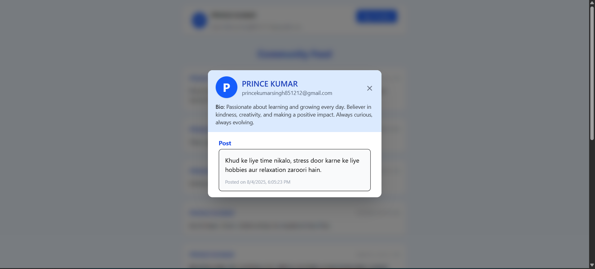

# MiniLinkedin - Mini LinkedIn-like Community Platform

> **Live Demo:** [Vercel Deployment Link](https://mini-linkdin-rnf9.vercel.app/) 
---

## 🖼️ App Screenshots

- 
- 
- 
- 

## Project Overview

MiniLinkedin ek chhota LinkedIn jaisa social platform hai jisme user registration, login, profile editing, aur post create karne ki suvidha hai. front-end React aur back-end Node.js/Express use kiya gaya hai.

---

## Tech Stack

| Layer          | Technology                      |
|----------------|--------------------------------|
| Frontend       | React, Redux Toolkit, Tailwind CSS, React Router |
| Backend        | Node.js, Express               |
| Database       | MongoDB (Mongoose ODM)         |
| Authentication | JWT (Access & Refresh Tokens)  |
| Utilities     | Axios, react-hot-toast, bcrypt, multer, helmet, cors |

---

## Features

- User Authentication (Register/Login with email & password)  
- User Profile (View & Edit name, email, bio)  
- Public Post Feed (Create, read, update, delete text-only posts)  
- Home feed showing posts with author name and timestamp  
- Automatic token refresh using refresh token  
- Responsive design with Tailwind CSS  
- Toast notifications for user feedback

---
  
## Contact

GitHub: [TheGitaPrince](https://github.com/TheGitaPrince)  
Email: princekumarsingh@gmail.com

---

**Thank you for checking out MiniLinkedin!**  
